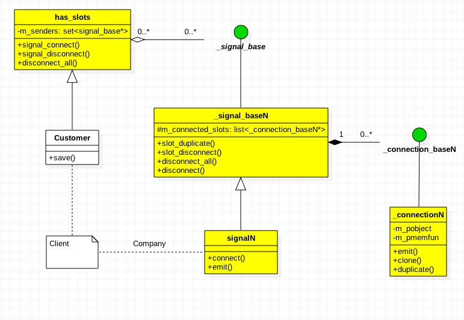
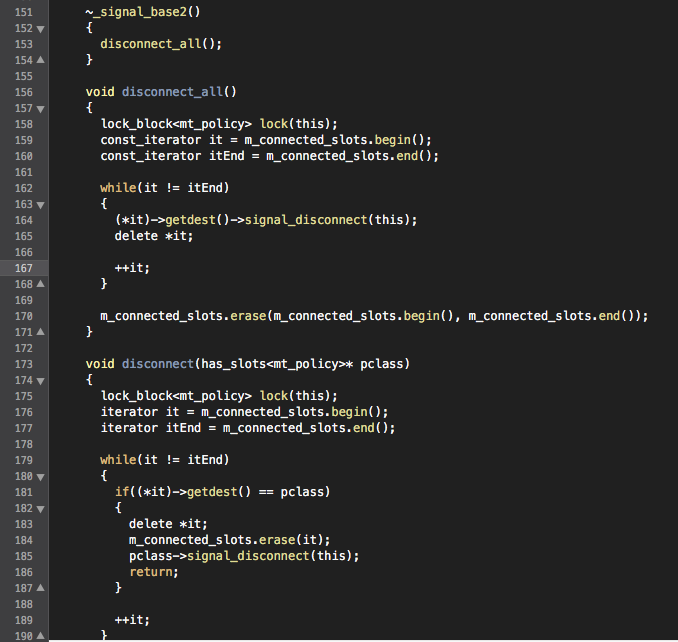
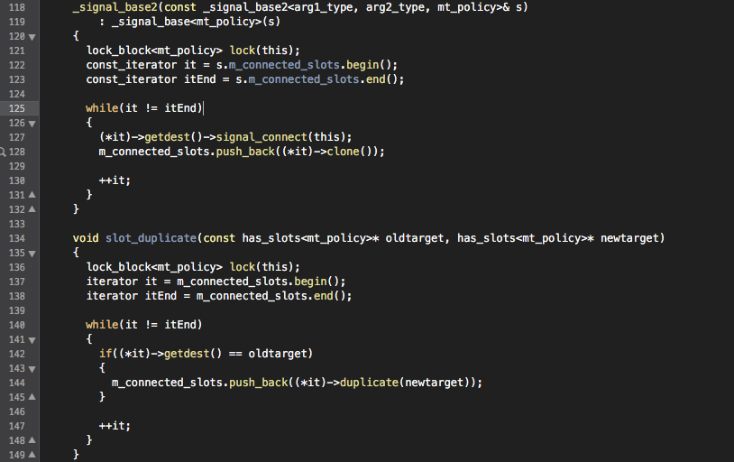
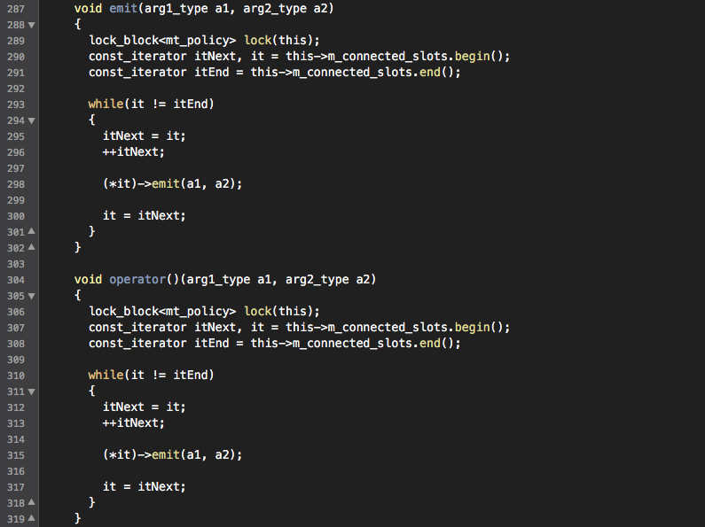
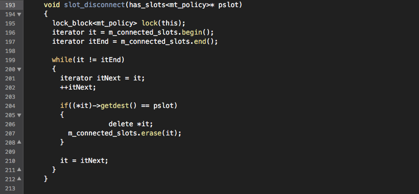

&emsp;&emsp;sigslot是一个基于信号槽机制的C++库，适用于对象之间的通信。  

<!-- More -->

&emsp;&emsp;在开发一个复杂工程的时候，经常会遇到这样一个问题：整个系统被分成数个模块，每个模块提供有限的功能，由上层调用组成整个系统，为了保证每个模块的独立性，我们经常会尽量限制模块与模块之间的直接联系，比如每个模块只提供有限的API或者COM接口，而内部实现则完全封闭起来。  
&emsp;&emsp;但有的时候会出一些设计要求，必须能够使模块之间能够直接通讯，而这两个模块往往处于不同的逻辑层次，之间相差甚远，如何设计它们之间的调用模式使整个工程维持整洁变得非常困难，比如模块直接直接包含对方的头文件会引起编译变得复杂，提供api或者接口会引起版本危机等问题。  

&emsp;&emsp;sigslot的出现为我们提供了一种解决问题的思想，它用“信号”的概念实现不同模块之间的传输问题，sigslot本身类似于一条通讯电缆，两端提供发送器和接收器，只要把两个模块用这条电缆连接起来就可以实现接口调用，而sigslot本身只是一个轻量级的作品，整个库只有一个.h文件，所以无论处于何种层次的库，都可以非常方便的包含它。

# 准备
&emsp;&emsp;为了简化待分析的代码，作如下操作：
* 编写只接受2个参数的单元测试代码；
* 删除所有非2个参数的模板特化；
* 删除所有“线程安全”部分代码。

# 分析
&emsp;&emsp;现在从实际代码开始：（L21---L320）  
1. 6个类：包括2个接口类（_signal_base, _connection_baseN)，2个抽象类（has_slots, _signal_baseN），2个实现类（signalN, _connectionN），关系如下所示：  

  

说明：Company/Customer是单元测试用例中通信的发布/订阅方，Client是调用发起方；  
2. client通过connect方法建立信号（signalN）到槽（has_slots)之间的连接；  
3. 连接建立后，用户就可以通过emit方法通知槽。  

注：   

* disconnect_all/disconnect方法用于断开连接关系；
  
    

* has_slots#signal_connect方法用于在signalN#connect的同时建立槽到信号的反向连接关系；  

  

这样建立起来的双向连接，可以在信号/槽对象销毁时，通过signal_disconnect/slot_disconnect方法主动断开与对方的连接，避免后续emit时碰到“野指针”的情形；  
* clone/duplicate/slot_duplicate方法用于对信号/槽进行拷贝/赋值时，其中的信号槽关系也能同步过去。  

    

有人认为这不是库应该做的事情，可以在需要的时候自行connect；但我不这么认为：首先，它真正体现了拷贝/赋值的含义，然后，就是当其connect很多slot的时候，一个个自行增加很麻烦（有些可能还不在当前上下文中），但我们不需要此功能时，完全可以disconnect_all/disconnect就可以了。

# 比较
&emsp;&emsp;基于信号槽机制的C++库比较

||优点|缺点|应用案例|
|---|---|---|---|
|QT|将信号槽完美融入到C++语言声明中；|无法应用于非QT项目，因为依赖于moc预处理；
|boost::signal(2)||需要boost其它库的支持||
|libsigc++|||gtkmm|
|sigslot|轻量级：只有一个头文件；无任何其它依赖；|slot只能是类的成员函数；slot只支持最多8个参数，而且只能是void类型返回值|delta3d;libjingle;WebRTC|

# 总结  
* STL是线程不安全的；  
* 对象间有建立连接的话，建议是双向连接，这样在各自析构中都能断开连接；  
* “线程安全”部分代码可以提出来重用；  
* 可用于“观察者模式”，包括日志系统；  
* signal成员变量以m_signalXXX形式命名，slot成员函数以onXXX形式命名，如：m_signalResize/onResize;  
* 私有的类使用“_”前缀；  

# 问题
* 为什么signal要采用组合模式，而slot采用继承模式呢？  
* 为什么容器迭代循环不使用for，而是while呢？  
* 如何解除slot中对参数个数与返回值类型的限制；  
* 如何解除slot必须是类的成员函数的限制；  
* 如何消除0-8个参数的模板特化中的大部分重复代码；  
* emit与operator()代码重复；  

  
  
* L193-L212: 通过容器迭代器删除元素时，后续操作还能进行吗?  
  
    
  
	可以进行后续删除操作，因为这里使用的是list容器，具体参考《Effective STL》第9条款；
* L222-L226: 成员变量应是m_pobject, m_pmemfun；  

  

附：[sigslot源代码分析](https://my.oschina.net/tianxialangui/blog/67005)