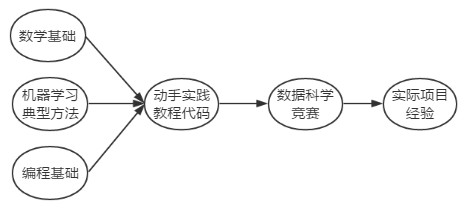

<!-- More -->

# 运行环境
## 本地
使用jupyter notebook，这里采用的是docker容器

1. 在安装了docker-compose的终端执行：`docker-compose up`
2. 在浏览器中打开日志中最后打印出的网址，如 `http://localhost:8888/?token=1c267204f7e6e244f39ab866d7c25ac4ef3e7aecc1bc7ddc`
3. 按`CTRL + C`停止运行

详见：[TensorFlow示例](https://github.com/denleyhsiao/TensorFlow-Tutorials)中的`Dockerfile`和`docker-compose.yml`

## 远程
使用Google Drive的Colaboratory

* 使用方法: [薅资本主义羊毛，用谷歌免费GPU](https://xw.qq.com/cmsid/20180127A0A2UC00)
* 上传数据: [完全云端运行：使用谷歌CoLaboratory训练神经网络](https://www.jiqizhixin.com/articles/2017-12-28-7)
* 两种访问google drive的方式
1. Here's an [example of using a FUSE Drive interface to access your Drive files like local files](https://colab.research.google.com/notebook#fileId=1srw_HFWQ2SMgmWIawucXfusGzrj1_U0q)
2. I'm guessing you also found the bundled example I/O notebook, which shows [how to use Python APIs to access files as well.](https://colab.research.google.com/notebook#fileId=/v2/external/notebooks/io.ipynb&scrollTo=c2W5A2px3doP)

# 方法
1. 看[普通程序员如何转向AI方向](http://www.cnblogs.com/subconscious/p/6240151.html)---关注他的博客
2. [TensorFlow 教程](https://zhuanlan.zhihu.com/p/26660699)
3. 吴恩达的[机器学习](https://www.coursera.org/learn/machine-learning)，不是cs229的版本
4. [并不一定需要完全掌握数学，也可以提前开始做一些尝试和学习](http://blog.jobbole.com/110557/)
5. 啃基础，强烈建议看台湾大学[李宏毅](http://speech.ee.ntu.edu.tw/~tlkagk/index.html)的[机器学习](https://www.bilibili.com/video/av10590361/#page=1)和[深度学习](https://www.bilibili.com/video/av9770302/):
6. 参加数据科学竞赛
* [一个进行数据发掘和预测竞赛的在线平台kaggle](https://zhuanlan.zhihu.com/p/25686876)
* [从零开始，教初学者如何征战全球最大机器学习竞赛社区Kaggle竞赛](https://baijia.baidu.com/s?id=1589819926995842562&wfr=pc&fr=ch_lst)
* [ImageNet/WebVision](https://baijiahao.baidu.com/s?id=1568611118856235&wfr=spider&for=pc)
* [google机器学习速成课程(含术语表)](https://developers.google.com/machine-learning/crash-course/?hl=zh-cn)
  - [谷歌发布机器学习速成课，居然是中文“授课”](http://tech.ifeng.com/a/20180301/44892434_0.shtml?_cpb_pindaotj7)
* [从机器学习谈起](https://www.cnblogs.com/subconscious/p/4107357.html#first)了解大概（入门）
  1. 线性代数：矩阵乘法；
  2. 高数：求导；
  3. 概率论：条件与后验概率
* 使用[google的models](https://github.com/tensorflow/models)模型实践中搞懂流程
* 将训练好的模型加入到你的app中，docker容器中，云端服务器中

# 论文
最近跟Alpha Go有关的的两篇论文

* [Masteing the game of Go without human knowledge](https://zhuanlan.zhihu.com/p/30707897)
* [Alpha Zero](https://arxiv.org/pdf/1712.01815.pdf)

# 参考
* [AI 是什么?](https://zhuanlan.zhihu.com/p/24919118)
* [人工智能入门必读的十本书](http://baijiahao.baidu.com/s?id=1562128446748480&wfr=spider&for=pc)
* [人工智能“六步走”学习路线](http://blog.csdn.net/isuccess88/article/details/54588131)
* [人工智能之机器学习路线图](http://blog.csdn.net/baihuaxiu123/article/details/52464510)
* [深度学习如何入门](https://www.zhihu.com/question/26006703/answer/275175035)
* [如何自学人工智能](https://www.zhihu.com/question/21277368)
* [TED/李飞飞：如何教计算机理解图片](https://open.163.com/movie/2015/3/Q/R/MAKN9A24M_MAKN9QAQR.html)

